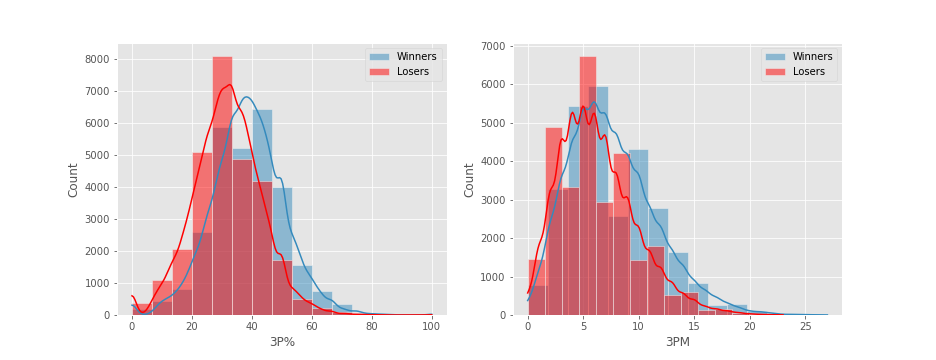

# nba-3pt-analysis

note* All data preparation and analysis can be found with annotated code in the file nba-3pt-analysis.ipynb. I will outline the most important details here.

Lets start with what we know anecdotally. 3-point shots have taken on a much bigger role in the NBA. Watching a game these days, it is rare to see anyone attempt a mid-range shot. Nearly all shots seem to come from either 3-point range, or right next to the hoop. At least thats the impression one would get watching the playoffs this year. Watching any sports talk show, you'll also hear about how the Warriors 3-pt heavy offense (which rose to prominance in their 2014 championship season) played a major role in ushering in this new era. So, does this impression hold true in the data?

All data was acquired from the official nba website (specifically, https://www.nba.com/stats/teams/boxscores/ ). 
From this page, I gathered the regular season data from the 1996-1997 season through the 2019-2020 season. To do so, I simply selected the 'All' rows option for each season, highlighted the data with a cursor, copied and then pasted the data into text files. Conveniently, the data pastes in as perfect TSV files.

Once I had a file for each season of interest, I wrote a script that imported all files into a single dataframe

I prepped the data by adding several useful columns, and breaking the data down into several useful dataframes. I added columns indicating whether the team was home or away and who their opponent was, and created separate dataframes for winners/losers. In addition, I created a 'matchups' dataframe that combined the two rows for each game (winner and loser) into a single row for direct comparisons, and an 'avgs' dataframe with the average values for each statistic each season.

## Beginning to analyze the data:

Lets start simple. How has the usage of 3-pointers changed over the years in our data set? Specifically, how many 2 and 3 point shots did teams attempt per game, and what percentage of shots were 2 pointers or 3 pointers? 

We can see that right around the time of the first recent Warriors championship, teams started to take a larger percentage of their shots from 3-point range, and a smaller percentage from 2 point range. However, if we look at the number of points scored on 2 vs. 3-pointers, we see that while teams score more points on 3-pointers than in the past, they do not score any fewer on 2-pointers. 

This means teams must be shooting 2-point shots more accurately than in the past.

Indeed we see this effect. This is likely a result of teams taking more layups and dunks, while taking fewer midrange shots. A deeper analysis of changes in 2-point shot locations certainly warrents interest, but it is outside of the scope of this project. From here, we will focus primarily on 3-pointers.

Lets begin by looking at the relationship between accurate 3-point shooting and winning games. To do so at a glance, we can look at the correlation between '3P%' (a measure of what percentage of 3-point shots are successful) and '+/-' (a stat tracking the difference in points between a team and their opponent).

While the correlation is never very high, we do see a clear increase over time. That is, accurate 3-point shooting has a stronger relationship with winning than it did in years past. So, is the relationship between winning and 3-point shooting significant? To start simple, lets ignore the changes over time and simply ask; do winning teams make more 3-pointers than losing teams? and do winning teams shoot 3-pointers more accurately? 

## Hypothesis test 1: 
### H0: Winning teams and losing teams shoot the same 3 point percentage on average
### HA: Winning teams shoot a better 3 point percentage than losing teams

## Parallel Hypothesis test:
### H0: Winning teams and losing teams make the same number of 3 point shots on average
### HA: Winning teams make more 3 point shots

T-Test 3-point percentage, winning teams vs losing teams, all seasons:

T-Statistic: 68.93042010909377

p-value: 0.0
 

T-Test 3-pointers made, winning teams vs losing teams, all seasons:

T-Statistic: 41.13423874186855

p-value: 0.0

Winning teams clearly shoot better 3-pt% and make more 3-pointers than losing teams, but perhaps this is unsurprising. Shooting more accurately ought to relate to winning, afterall. What we would like to know is whether it benefits teams to take more 3-pointers. We can formalize this into a hypothesis:

## Hypothesis test 2: 
### H0: Winning teams and losing teams take the same percentage of their shots from 3-point range
### HA: Winning teams take a larger percentage of their shots from 3-point range.

T-Test 3-pointers attempted per shot attempt, winning teams vs losing teams, full data set:

T-Statistic: 3.666347910434493

p-value: 0.0002462639978413611

Interesting! We can see now that winning teams take a larger percentage of their shots from 3-point range, so it is likely beneficial for teams to shoot more 3-pointers. 

So far we have looked at an aggregation of all individual games, but given that basketball is a team sport, perhaps it would be more informative to aggregate our data by team and season. To do so, I wrote a function that groups data by team and season, sums the rows, and then cleans up the rows for which summing is not the correct approach (like 3-point percentage).

Now that we have data aggregated by team, we can look at the relationship between 3-point shooting stats and win percentage, instead of just breaking data into winners and losers. We can start with some scatter plots of win percentage vs 3-point accuracy.

